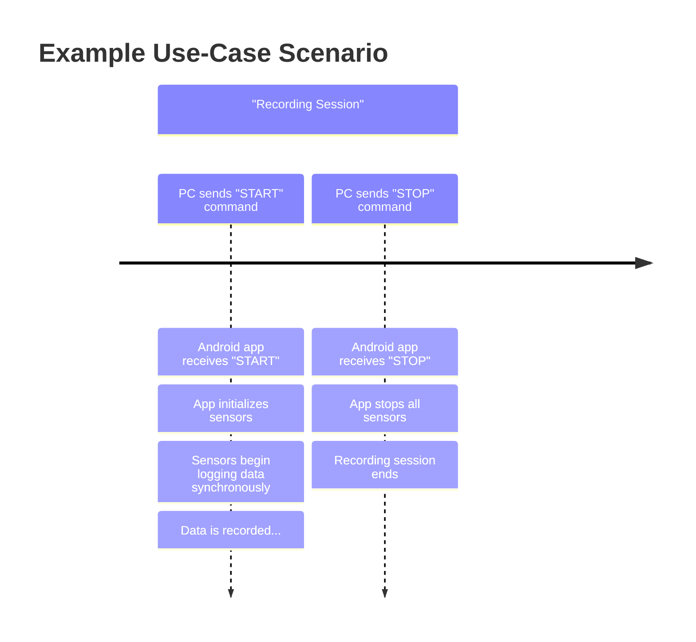

### Figure: Example Use-Case Scenario Timeline

This timeline illustrates a typical recording session. The process is initiated by a "START" command from the PC, which
triggers the Android application to start recording data from all sensors synchronously. The session continues until the
PC sends a "STOP" command, at which point the application stops the sensors and finalizes the recording.
