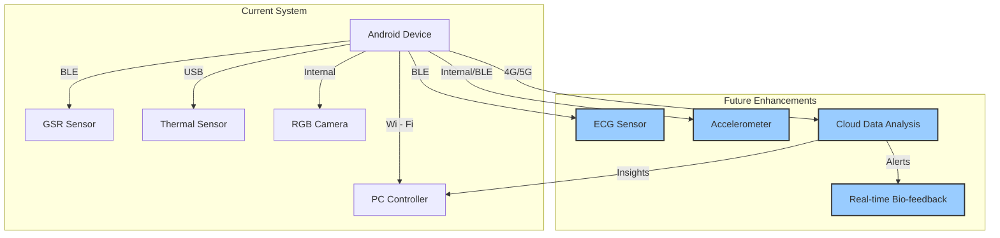

### Figure: Proposed Future System Enhancements

This diagram illustrates potential future enhancements to the system.

- **Additional Sensors:** The system could be extended to include other physiological sensors, such as an **ECG Sensor**
  for heart rate variability analysis, or an **Accelerometer** for activity tracking.
- **Cloud Data Analysis:** The collected data could be streamed to a **Cloud Data Analysis** platform in real-time. This
  would enable more sophisticated analysis and the generation of deeper insights.
- **Real-time Bio-feedback:** The insights from the cloud analysis could be used to provide **Real-time Bio-feedback**
  to the user or the experimenter.
