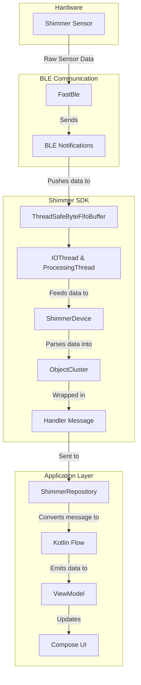

### Shimmer Data Pipeline

This diagram illustrates the flow of data from the Shimmer sensor to the application's UI.

1. The **Shimmer Sensor** transmits raw data via BLE.
2. The **FastBle** library receives this data through **BLE Notifications**.
3. The data is pushed into a **ThreadSafeByteFifoBuffer** to ensure no data is lost.
4. The **IOThread** and **ProcessingThread** in the Shimmer SDK read from the buffer and feed the data to the *
   *ShimmerDevice**.
5. The `ShimmerDevice` parses the raw data and organizes it into an **ObjectCluster**.
6. The `ObjectCluster` is then wrapped in a **Handler Message** and sent to the application layer.
7. The **ShimmerRepository** receives the `Handler` message and converts it into a **Kotlin Flow**.
8. The **ViewModel** collects the data from the `Flow` and updates the **Compose UI**.
