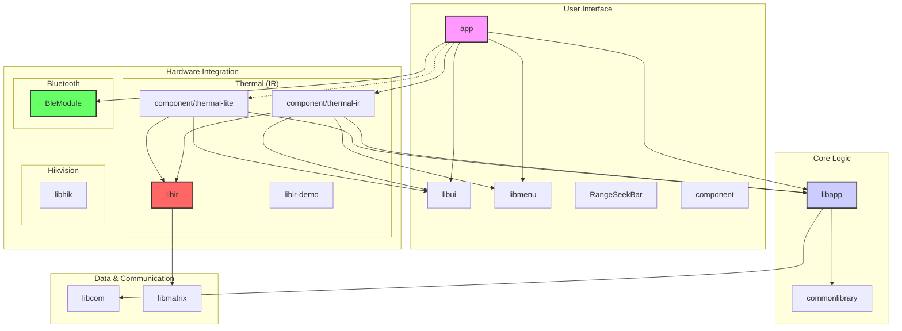

**Diagram Description:**

This diagram shows the high-level module structure of the Topdon application.

* **User Interface (Green):** The `app` module is the main application entry point. It utilizes UI components from
  `libui`, `libmenu`, `RangeSeekBar`, and the `component` module.
* **Core Logic (Blue):** `libapp` and `commonlibrary` provide the core application logic and shared functionalities.
* **Hardware Integration (Red/Yellow):**
    * The application integrates with thermal cameras through the `libir`, `component/thermal-ir`, and
      `component/thermal-lite` modules. `libir-demo` is likely a demonstration of the `libir` capabilities.
    * Bluetooth functionality is handled by `BleModule`.
    * `libhik` suggests a possible integration with Hikvision devices.
* **Data & Communication (Gray):** `libcom` likely handles general communication protocols, and `libmatrix` may be used
  for image processing or data transformation.

The arrows indicate dependencies between the modules. For example, the `app` module depends on `libapp`, `libui`,
`libmenu`, `BleModule`, and the thermal components.
