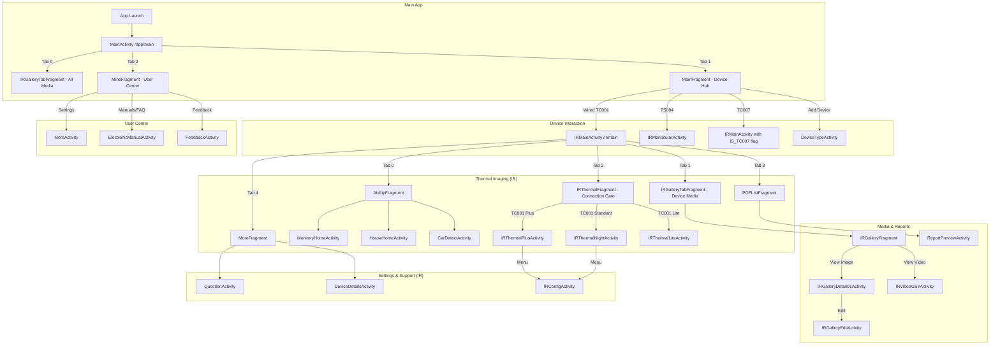

**Diagram Description:**

This diagram visualizes the navigation flow within the Topdon application.

1. **Main App:** The app launches into `MainActivity`, which has three main tabs: a gallery, a device hub, and a user
   center.
2. **Device Interaction:** From the `MainFragment` (device hub), the user can connect to different devices, which will
   navigate them to the corresponding activity (e.g., `IRMainActivity` for the TC001).
3. **Thermal Imaging (IR):** The `IRMainActivity` is the central hub for thermal imaging tasks. It's a tabbed activity
   that provides access to:
    * **AbilityFragment:** Shortcuts for specific tasks.
    * **IRGalleryTabFragment:** Media gallery for the connected device.
    * **IRThermalFragment:** The connection gate, which directs the user to the correct thermal camera activity based on
      the connected hardware (Plus, Standard, or Lite).
    * **PDFListFragment:** For viewing reports.
    * **MoreFragment:** For device utilities and help.
4. **Media & Reports:** This section shows the flow for viewing and editing images and videos, as well as for previewing
   reports.
5. **Settings & Support:** The user can access various settings and support screens from both the `MineFragment` and the
   `IRMainActivity`.
