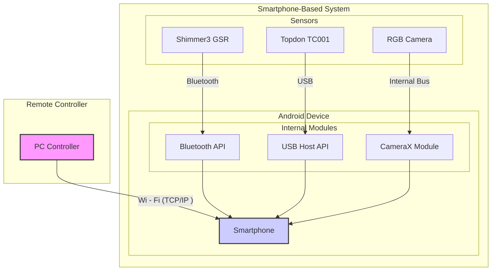

### Figure: Multi-Sensor System Overview

This diagram provides a high-level overview of the entire system. It shows the central smartphone-based system, which
includes the Android device and the three sensors: the Shimmer3 GSR (connected via Bluetooth), the Topdon TC001 thermal
camera (connected via USB), and the phone's internal RGB camera (accessed via CameraX). The system is controlled
remotely by a PC over a Wi-Fi connection.
