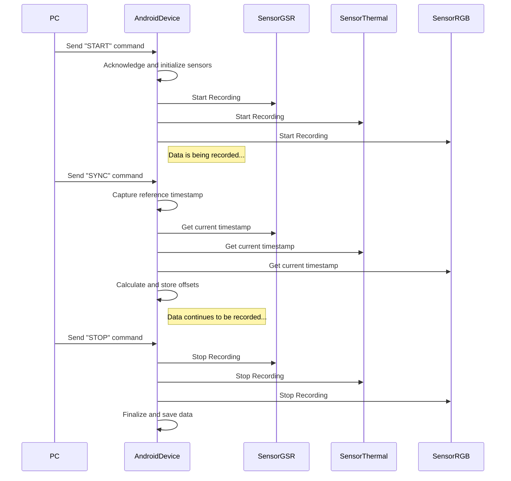

### Figure: Communication Sequence Diagram (PC–Device Interaction)

This sequence diagram shows the real-time messaging between the PC orchestrator and the Android device.

1. The PC initiates the recording session by sending a "START" command.
2. The Android device receives the command, acknowledges it, and starts recording from all three sensors.
3. During the recording, the PC can send a "SYNC" command. The Android device responds by capturing a reference
   timestamp and calculating the time offsets for each sensor, which will be used later to align the data.
4. Finally, the PC sends a "STOP" command to end the recording session. The Android device stops all sensors and saves
   the collected data.
