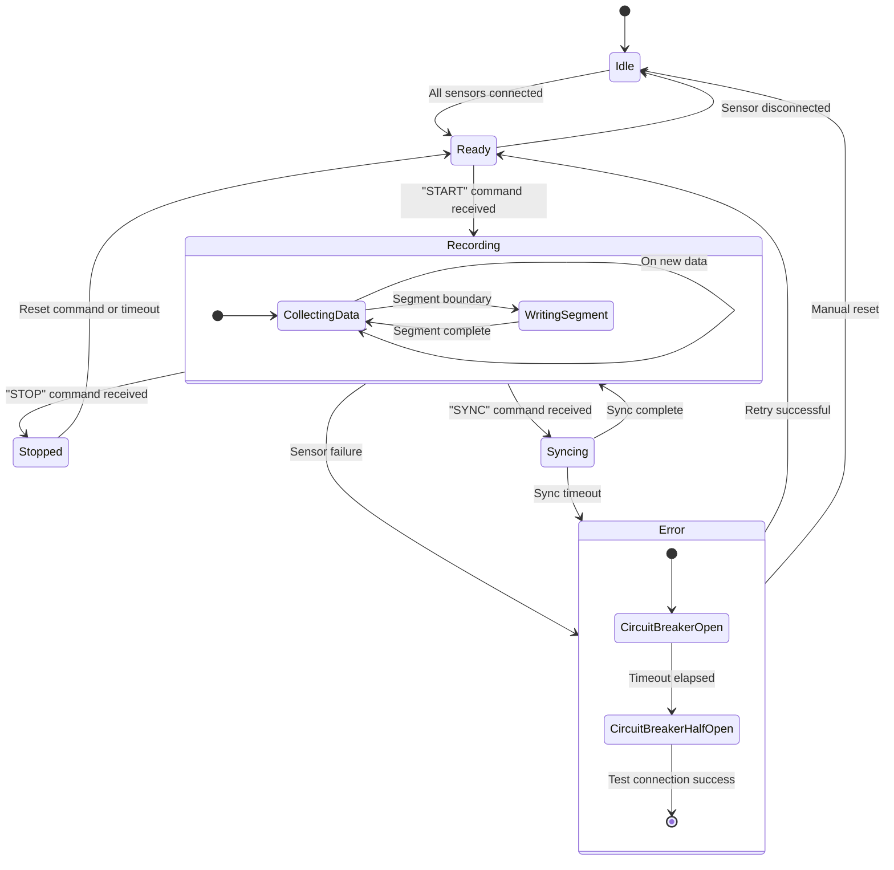

**Last Modified:** 2025-10-14 11:00 UTC  
**Modified By:** GitHub Copilot CLI  
**Document Type:** Architecture Visualisation

### Figure: Software State Machine for Recording Control (Updated 2025-10-14)

This state diagram illustrates the production behaviour of the Android recording application with comprehensive error handling.

**Primary States:**

- **Idle:** Initial state. Application waits for all required sensors to connect. Result pattern validates connection attempts.
- **Ready:** All sensors connected and validated. Application ready to start recording. Sensor disconnection returns to Idle.
- **Recording:** Actively recording data from all sensors. Entered on "START" command from PC orchestrator or local control.
- **Syncing:** Temporary state for time synchronisation with orchestrator NTP-like protocol. Returns to Recording on success.
- **Error:** Sensor failure or sync timeout. Circuit breaker engages to prevent resource drain.
- **Stopped:** Recording stopped by "STOP" command. Can transition back to Ready for new recording session.

**Recording Sub-states:**

- **CollectingData:** Continuous data acquisition from all sensor streams with shared timestamps.
- **WritingSegment:** Periodic segment boundary writes ensure crash-safe MediaStore operations and manifest updates.

**Error Handling Sub-states:**

- **CircuitBreakerOpen:** Connection failures trigger circuit breaker. Countdown displayed to user. Prevents battery drain.
- **CircuitBreakerHalfOpen:** After timeout, test connection attempted. Success closes circuit, failure reopens.

**Key Improvements:**

- Result pattern replaces exception-based error flow
- Circuit breaker protects against connection failure loops
- Segment-based recording survives application crashes
- Explicit error state with recovery paths
- Resource cleanup enforced on all state transitions
