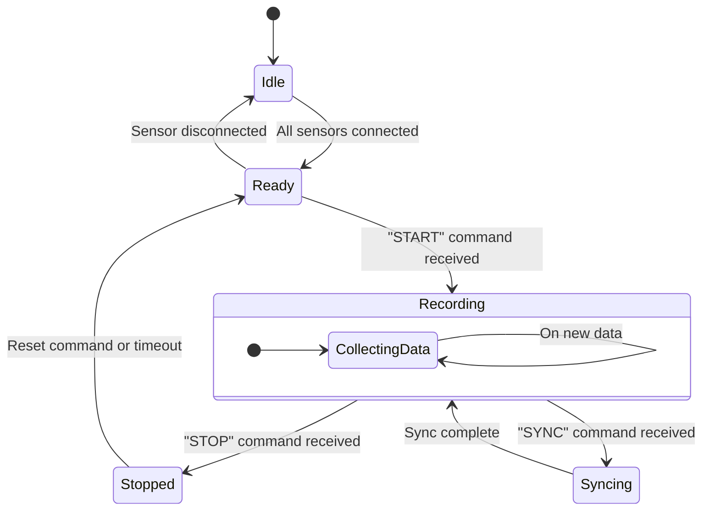

### Figure: Software State Machine for Recording Control

This state diagram illustrates the behavior of the Android recording application.

- **Idle:** The initial state. The application is waiting for all required sensors to be connected.
- **Ready:** All sensors are connected and the application is ready to start recording. If a sensor disconnects, it
  returns to the `Idle` state.
- **Recording:** The application is actively recording data from all sensors. This state is entered upon receiving a "
  START" command from the PC.
- **Syncing:** A temporary state entered upon receiving a "SYNC" command. The application performs a time
  synchronization and then returns to the `Recording` state.
- **Stopped:** The recording has been stopped by a "STOP" command. The application can transition back to the `Ready`
  state to begin a new recording.
