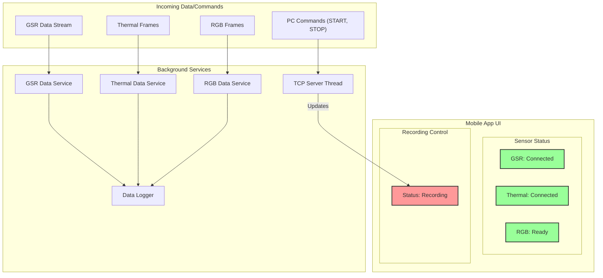

### Figure: Mobile App UI and Data Flow

This diagram provides a conceptual representation of the mobile application's user interface and its internal data flow.

- **Mobile App UI:** The UI displays the connection status of each sensor and the current recording status of the
  application.
- **Background Services:** Several background services run to handle different tasks:
    - A **TCP Server** listens for commands from the PC.
    - Separate data services for **GSR, Thermal, and RGB** handle the incoming data from each sensor.
    - A **Data Logger** is responsible for writing the data from all sensors to storage.
- **Data Flow:**
    - Commands from the PC are received by the TCP server, which then updates the recording status on the UI.
    - Data from each sensor is processed by its respective service and then passed to the data logger to be saved.
