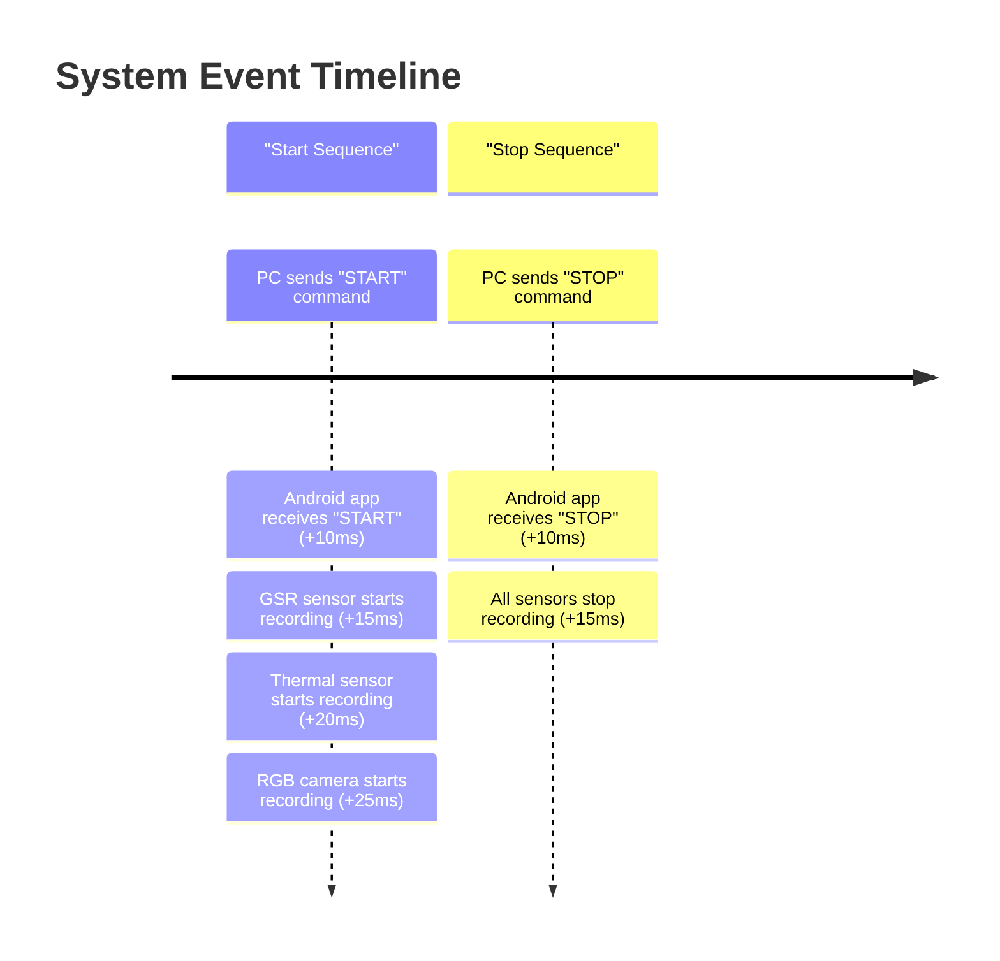

### Figure: System Event Timeline and Synchronization

This timeline provides a conceptual illustration of the system's synchronization performance during a recording session.
It shows the small delays (offsets) between the PC issuing a command and the individual sensors starting to record. For
example, after the PC sends the "START" command, there is a 10ms delay for the command to be received by the app, and
then each sensor starts with a slightly different delay. This visualization helps to demonstrate that all sensors begin
recording within a tight time window, validating the system's synchronization capabilities.
