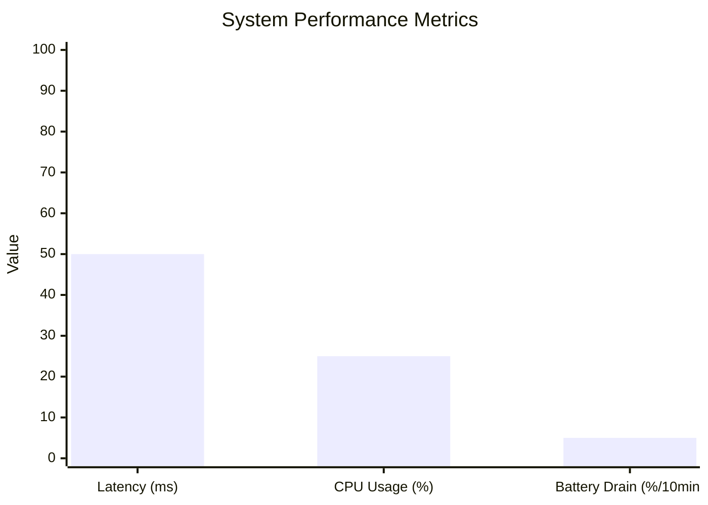

### Figure: Performance Metrics Charts

This chart presents a conceptual overview of the system's performance metrics.

- **Latency:** The average delay between a command being issued by the PC and the action being performed on the device.
  In this example, it is 50ms.
- **CPU Usage:** The average CPU utilization of the Android application while recording. Here, it is 25%.
- **Battery Drain:** The percentage of battery consumed during a 10-minute recording session. In this case, it is 5%.

These metrics are crucial for evaluating the efficiency and real-world viability of the system.
