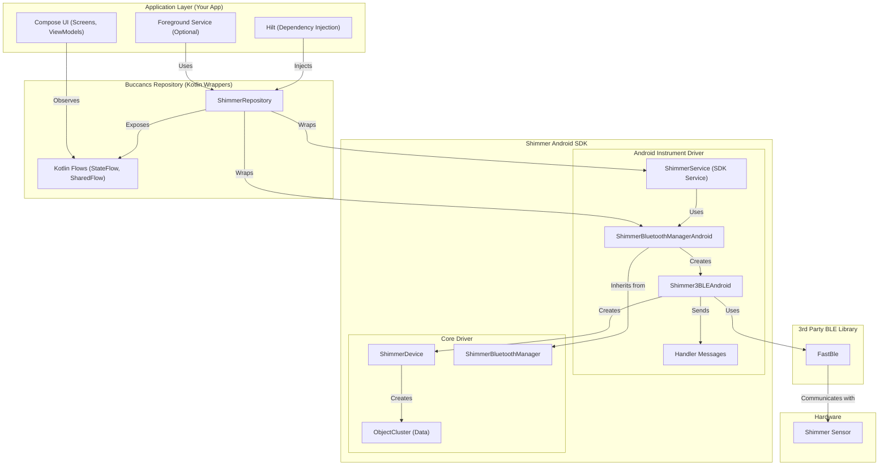

### Shimmer Integration Architecture

This diagram shows a recommended architecture for integrating the Shimmer SDK into a modern Android application using
Jetpack Compose and Hilt.

- **Application Layer:** This is your application's UI layer, built with Compose. ViewModels observe data from the
  repository, and a foreground service can be used to manage long-running connections.
- **Buccancs Repository:** This is a crucial layer that you will create. It acts as a bridge between the Shimmer SDK and
  your application. It wraps the `Handler`-based SDK and exposes the data as modern Kotlin `Flows`, which are much
  easier to work with in a Compose-based architecture.
- **Shimmer Android SDK:** This is the provided Shimmer SDK, consisting of the Android-specific instrument driver and
  the core driver libraries.
- **3rd Party BLE Library:** The Shimmer SDK uses the `FastBle` library for its Bluetooth Low Energy communication.
- **Hardware:** The physical Shimmer sensor.

The key takeaway here is the use of a repository to abstract away the complexities of the Shimmer SDK and provide a
clean, modern API to the rest of your application.
