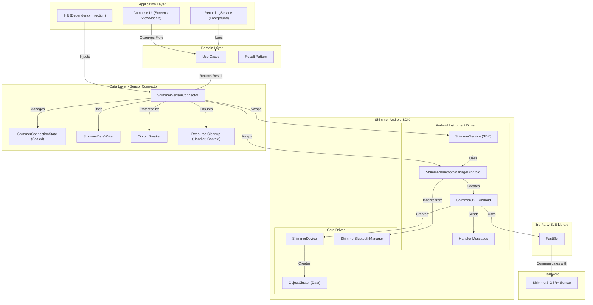

**Last Modified:** 2025-10-14 11:00 UTC  
**Modified By:** GitHub Copilot CLI  
**Document Type:** Architecture Visualisation

### Shimmer Integration Architecture (Updated 2025-10-14)

This diagram shows the production architecture for Shimmer SDK integration with modern error handling, state management,
and resource cleanup.

**Key Architectural Improvements:**

- **Result Pattern:** Type-safe error handling with `Result<T, E>` replacing exceptions throughout connector layer
- **State Machine:** `ShimmerConnectionState` sealed class with explicit states (Disconnected, Connecting, Connected,
  Recording, Error)
- **Circuit Breaker:** Connection failure protection prevents battery drain from repeated failed attempts with
  user-friendly countdown
- **Resource Cleanup:** Fixed memory leaks - proper Handler, Context, and Bluetooth lifecycle management
- **Data Writer:** Separated CSV writing logic into `ShimmerDataWriter` for testability
- **Domain Layer:** Use cases abstract business logic from UI and hardware concerns

**Layer Responsibilities:**

- **Application Layer:** Compose UI observes data via ViewModels, RecordingService coordinates multi-sensor capture
- **Domain Layer:** Use cases implement business logic, return Result types for error propagation
- **Data Layer:** ShimmerConnector wraps SDK complexity, manages state machine, ensures resource cleanup
- **Shimmer SDK:** Provided Android-specific instrument driver and core driver libraries
- **FastBle:** Third-party Bluetooth Low Energy communication library
- **Hardware:** Shimmer3 GSR+ physical sensor with 128Hz sampling
