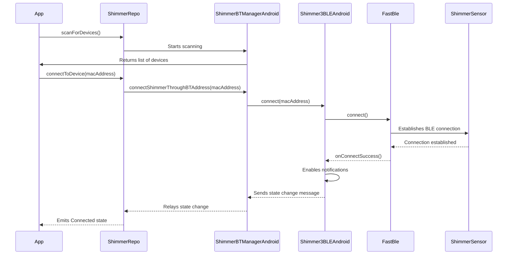

### Shimmer BLE Connection Sequence Diagram

This diagram shows the sequence of events for connecting to a Shimmer sensor.

1. The application initiates a device scan through the `ShimmerRepository`.
2. The repository uses `ShimmerBluetoothManagerAndroid` to perform the scan and returns a list of discovered devices to
   the app.
3. The user selects a device, and the app calls `connectToDevice()` on the repository.
4. The repository then calls down through the Shimmer SDK to `Shimmer3BLEAndroid`, which in turn uses the `FastBle`
   library to establish a connection with the sensor.
5. Once the connection is successful, `FastBle` calls back to `Shimmer3BLEAndroid`, which then enables notifications on
   the appropriate BLE characteristic.
6. Finally, the connection status is propagated back up to the application, which can then update its UI to reflect the
   new state.
