```mermaid
graph TD
    subgraph "Application Layer"
        MainActivity["MainActivity (/app/main)"]
        IRMainActivity["IRMainActivity (/ir/main)"]
        App["App.kt (Application Class)"]
    end

    subgraph "UI & Navigation"
        ARouter["ARouter"]
        ViewPager["ViewPager2"]
        LibUI["libui"]
        LibMenu["libmenu"]
    end

    subgraph "Core & Business Logic"
        LibApp["libapp"]
        SharedManager["SharedManager (State)"]
        DeviceTools["DeviceTools (USB Logic)"]
        EventBus["EventBus"]
        LMS_SDK["LMS SDK (Cloud)"]
    end

    subgraph "Thermal Components"
        ThermalIR["component/thermal-ir (Plus/Std)"]
        ThermalLite["component/thermal-lite (Lite)"]
        IRThermalPlusActivity["IRThermalPlusActivity"]
        IRThermalLiteActivity["IRThermalLiteActivity"]
    end

    subgraph "Vendor SDK (libir)"
        USBManager["USBMonitorManager"]
        IRCMD["IRCMD (Low-level commands)"]
        LibIRProcess["LibIRProcess (Frame Conversion)"]
        IRImageHelp["IRImageHelp (Pseudo-color)"]
        SupHelp["SupHelp (Super-resolution)"]
    end

    subgraph "Hardware"
        HW_TC001["TC001 Hardware"]
    end

    App --> LibApp
    App --> LMS_SDK
    MainActivity -- Navigates via ARouter --> IRMainActivity
    MainActivity -- Uses --> ViewPager
    IRMainActivity -- Uses --> ViewPager
    MainActivity -- Listens for --> EventBus
    IRMainActivity -- Listens for --> EventBus
    LibApp --> SharedManager
    LibApp --> DeviceTools
    LibApp --> EventBus
    ThermalIR --> IRThermalPlusActivity
    ThermalLite --> IRThermalLiteActivity
    IRThermalPlusActivity -- Uses --> LibUI
    IRThermalPlusActivity -- Uses --> LibMenu
    IRThermalPlusActivity -- Interacts with --> USBManager
    IRThermalPlusActivity -- Interacts with --> IRCMD
    IRThermalPlusActivity -- Interacts with --> LibIRProcess
    IRThermalPlusActivity -- Interacts with --> IRImageHelp
    IRThermalPlusActivity -- Interacts with --> SupHelp
    IRThermalLiteActivity -- Uses --> LibUI
    IRThermalLiteActivity -- Uses --> LibMenu
    IRThermalLiteActivity -- Interacts with --> LibIRProcess
    USBManager -- Communicates with --> HW_TC001
    DeviceTools -- Broadcasts on --> EventBus
```

### Topdon Architecture Diagram

This diagram provides a more detailed look at the architecture of the Topdon application.

- **Application Layer:** Contains the main `Activity` and `Application` classes that serve as entry points to the app.
- **UI & Navigation:** Shows the components responsible for the user interface and navigation, including `ARouter` for
  routing, `ViewPager2` for tabbed layouts, and the `libui` and `libmenu` libraries for UI elements.
- **Core & Business Logic:** This is the heart of the application, containing the `libapp` library, which manages the
  application's state (`SharedManager`), handles USB device logic (`DeviceTools`), and facilitates communication between
  components via an `EventBus`. It also includes the LMS SDK for cloud-based features.
- **Thermal Components:** These are the feature modules that handle the different versions of the TC001 camera.
- **Vendor SDK (`libir`):** This layer contains the proprietary libraries provided by the hardware vendor for
  interacting with the thermal camera.
- **Hardware:** The physical TC001 device.

The arrows indicate the flow of control and data between the different components.
