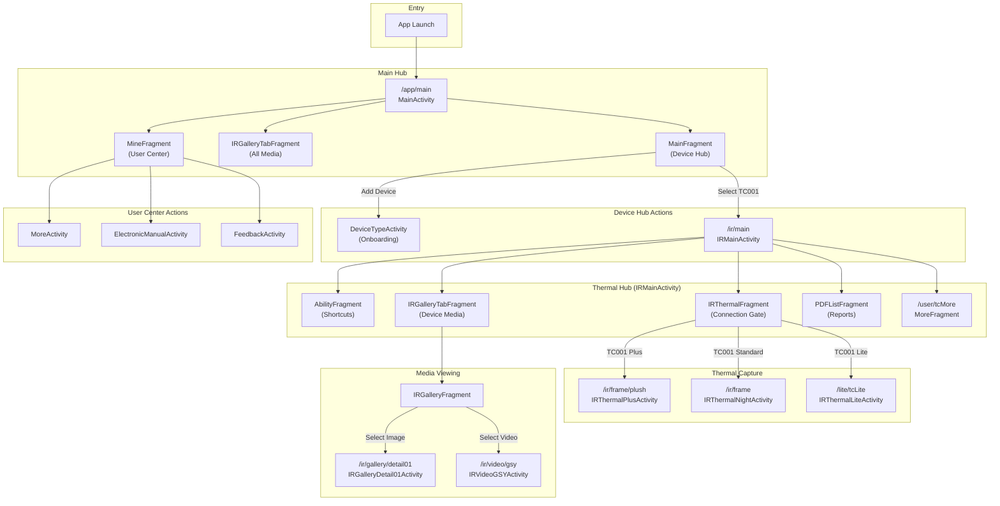

### Topdon Detailed Navigation Graph

This graph provides a more detailed view of the navigation flow within the Topdon application, including the ARouter
paths for key activities.

- The application starts in `MainActivity`, which serves as the main hub.
- The `MainFragment` within `MainActivity` acts as a device hub, allowing the user to connect to a TC001 device, which
  takes them to the `IRMainActivity`.
- The `IRMainActivity` is the central point for all thermal imaging related tasks. Its `IRThermalFragment` acts as a
  gate to the specific capture activity (`Plus`, `Night`, or `Lite`) based on the connected hardware.
- The diagram also shows the flow for accessing media in the gallery and the various screens available from the user
  center.
