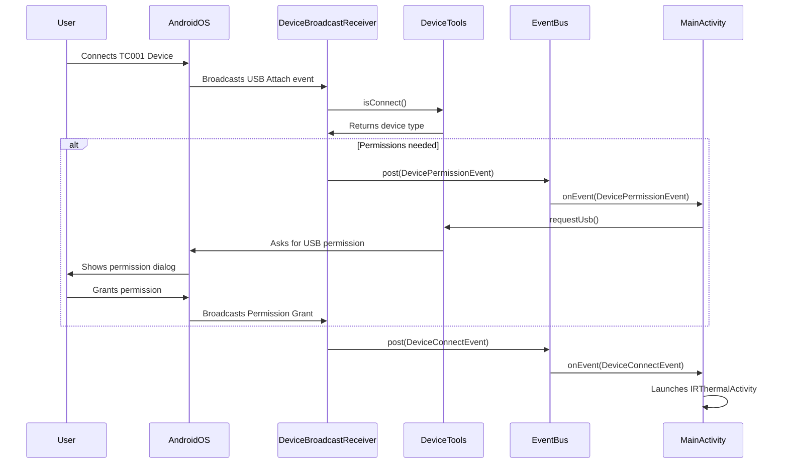

### Topdon USB Connection Sequence Diagram

This diagram shows the sequence of events that occur when a user connects a TC001 device to their Android phone.

1. The user connects the device, and the Android OS broadcasts a USB attach event.
2. The `DeviceBroadcastReceiver` receives this event and uses `DeviceTools` to identify the device.
3. If USB permissions have not been granted, a `DevicePermissionEvent` is posted on the `EventBus`.
4. `MainActivity` receives this event and requests USB permission from the user.
5. Once permission is granted, or if it was already granted, a `DeviceConnectEvent` is posted.
6. `MainActivity` receives the connect event and launches the appropriate thermal imaging activity.
